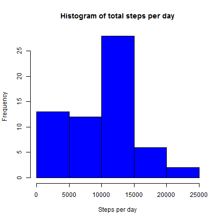
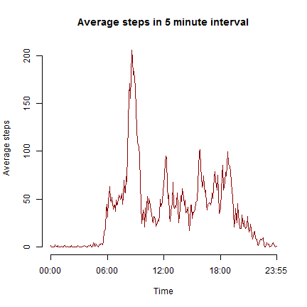
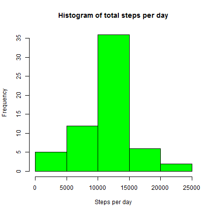
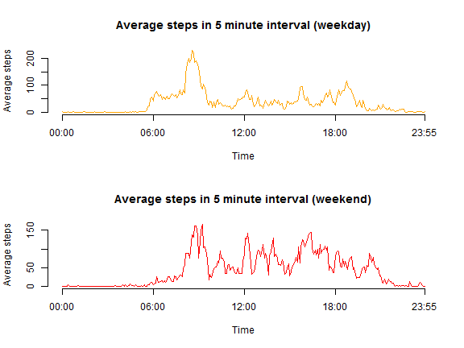

# Reproducible Research Peer Assessment 1

## Loading and preprocessing the data


The following code reads the data into R and converts the class of the date variable.


```r
setwd("C:/Users/Kenneth Lim/Desktop/DataScience/5. Reproducible Research/repdata-data-activity")
data <- read.csv("activity.csv")
data$date <- as.Date(data$date, "%Y-%m-%d")
```


## What is mean total number of steps taken per day?


The following code sums the steps taken by date, ignoring missing values. 


```r
daydata <- aggregate(data$steps, by=list(date=data$date), FUN=sum, na.rm=TRUE)
colnames(daydata)[2] <- "steps"
```

### Histogram of total steps per day


```r
hist(daydata$steps, main="Histogram of total steps per day", xlab="Steps per day", col="blue")
```

 

### Mean and median of total steps per day (ignoring missing data)


```r
mean(daydata$steps, na.rm=TRUE)
```

```
## [1] 9354.23
```

```r
median(daydata$steps, na.rm=TRUE)
```

```
## [1] 10395
```


## What is the average daily activity pattern?


The following code averages the steps taken by 5 minute interval, ignoring missing data.


```r
intdata <- aggregate(data$steps, by=list(interval=data$interval), FUN=mean, na.rm=TRUE)
intdata$interval <- sprintf("%04d", intdata$interval)
intdata$interval <- as.POSIXct(intdata$interval, format = "%H%M")
intdata$interval <- format(intdata$interval, format="%H:%M") 
colnames(intdata)[2] <- "steps"
```

### Time series plot of average number of steps taken by interval


```r
plot(intdata$steps, type="l", xlab="Time", ylab="Average steps", main="Average steps in 5 minute interval", axes=FALSE, col="darkred")
axis(1, at=c(1, 73, 145, 217, 288), labels=c("00:00", "06:00", "12:00", "18:00", "23:55"))
axis(2)
```

 

### 5-minute interval containing the maximum number of steps on average


```r
intdata[which.max(intdata[ ,"steps"]), ][ ,"interval"]
```

```
## [1] "08:35"
```

The 5-minute interval containing the maximum number of steps on average is 08:35 (or more specifically, 08:35 to 08:40).


## Imputing missing values


### Number of missing values in the dataset


```r
summary(data$steps)
```

```
##    Min. 1st Qu.  Median    Mean 3rd Qu.    Max.    NA's 
##    0.00    0.00    0.00   37.38   12.00  806.00    2304
```

There are 2304 missing values in the dataset.

### Strategy to impute missing data

To decide how to impute missing data, I first look at what the imputed data is going to be used for. I need to compare the distribution of the new dataset (via a histogram, and calculations of mean and median) with the original dataset. The missing data is also to be used to compare the number of steps taken during weekdays and weekends.

If I impute missing values using the mean of observed instances, this will distort the distribution: the distribution will seem less variable than it actually is. However, given the ultimate aim to compare average number of steps taken on weekdays and weekends, I will simply impute missing data using the mean for that 5 minute interval. This has the disadvantage of possibly understating the differences between weekdays and weekends (if any).

### Imputation of missing data

This is the imputation function used to impute missing data. The loop function checks each row of the data, and replaces the steps variable with the mean of the 5 minute interval (for observed instances).


```r
imputeddata <- data

imputeddata$interval <- sprintf("%04d", imputeddata$interval)
imputeddata$interval <- as.POSIXct(imputeddata$interval, format = "%H%M")
imputeddata$interval <- format(imputeddata$interval, format="%H:%M") 

for (i in 1:17568) {
    if (is.na(imputeddata[i,]$steps)) {
        value <- subset(intdata, interval==imputeddata[i,][,"interval"])[,"steps"]
        imputeddata[i,][,"steps"] <- value 
    }
}
```

Check that there are no more missing data:


```r
summary(imputeddata$steps)
```

```
##    Min. 1st Qu.  Median    Mean 3rd Qu.    Max. 
##    0.00    0.00    0.00   37.38   27.00  806.00
```

There are no more "NA"s in the imputed data.

### Histogram of total steps taken each day, and mean and median of total steps per day


```r
imputeddaydata <- aggregate(imputeddata$steps, by=list(date=imputeddata$date), FUN=sum)
colnames(imputeddaydata)[2] <- "steps"
```


```r
hist(imputeddaydata$steps, main="Histogram of total steps per day", xlab="Steps per day", col="green")
```

 

This histogram is different from the one plotted previously (in blue). The previous histogram had a fatter left tail because there were some days where there were no readings at all (resulting in total steps of zero). With the imputation, the frequency of such days is transferred to the mean. We see a greater number of days with steps between 10000 and 15000 as a result of the imputation. The second, fourth and fifth intervals are unchanged. 


```r
mean(imputeddaydata$steps)
```

```
## [1] 10766.19
```

```r
median(imputeddaydata$steps)
```

```
## [1] 10766.19
```

The mean increases because the days with missing data now have "steps". The median also increases, and this observation may also be attributed to the days which have "steps" now. 

## Are there differences in activity patterns between weekdays and weekends?


### Creating a new factor variable for weekdays and weekends

The code below determines the day of the week, and creates a logical variable indicating a weekday or a weekend. 


```r
imputeddata$day <- weekdays(imputeddata$date)

imputeddata$type <- 0

for (i in 1:nrow(imputeddata)) {
    if (imputeddata[i,]$day == "Saturday") {
        imputeddata[i,]$type <- "weekend"
    }
    else if (imputeddata[i,]$day == "Sunday") {
        imputeddata[i,]$type <- "weekend"
    }
    else {
        imputeddata[i,]$type <- "weekday"
    }
}

imputeddata$type <- as.factor(imputeddata$type)
```

### Panel time series plot comparing weekdays and weekends

The following code averages the steps taken by 5 minute interval separately for weekdays and weekends.


```r
wkdayimputed <- subset(imputeddata, type=="weekday")
weekday <- aggregate(wkdayimputed$steps, by=list(interval=wkdayimputed$interval), FUN=mean)
colnames(weekday)[2] <- "steps"

wkendimputed <- subset(imputeddata, type=="weekend")
weekend <- aggregate(wkendimputed$steps, by=list(interval=wkendimputed$interval), FUN=mean)
colnames(weekend)[2] <- "steps"
```

The following code graphs weekday and weekend data separately in a panel plot.


```r
par(mfrow = c(2, 1))
plot(weekday$steps, type="l", xlab="Time", ylab="Average steps", main="Average steps in 5 minute interval (weekday)", axes=FALSE, col="orange")
axis(1, at=c(1, 73, 145, 217, 288), labels=c("00:00", "06:00", "12:00", "18:00", "23:55"))
axis(2)
plot(weekend$steps, type="l", xlab="Time", ylab="Average steps", main="Average steps in 5 minute interval (weekend)", axes=FALSE, col="red")
axis(1, at=c(1, 73, 145, 217, 288), labels=c("00:00", "06:00", "12:00", "18:00", "23:55"))
axis(2)
```

 

Activity is more spread out on weekends. Although the maximum for a 5 minute interval is lower, the level of activity is more sustained throughout the day. The individual tends to wake up later on weekends, and go to bed later on weekends. 


## Sources consulted

[Missing data imputation, by Andrew Gelman] (http://www.stat.columbia.edu/~gelman/arm/missing.pdf)
